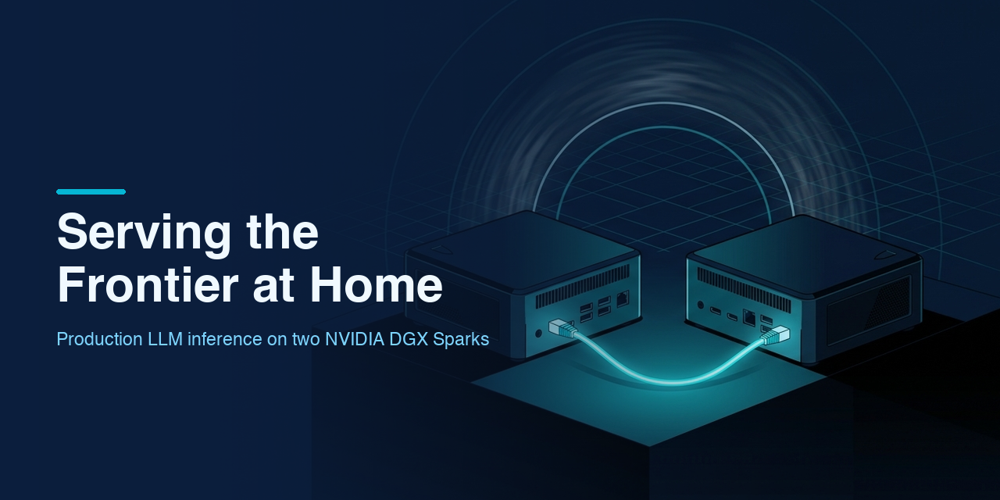

# Serving the Frontier at Home



[](https://github.com/di37/serving-the-frontier-at-home/actions/workflows/deploy.yml)

**[Read the handbook →](https://di37.github.io/serving-the-frontier-at-home/)** &nbsp;·&nbsp; [Download the PDF](https://di37.github.io/serving-the-frontier-at-home/serving-the-frontier-at-home.pdf)

A 229-page technical handbook on running frontier-class language models on two [NVIDIA DGX Spark](https://www.nvidia.com/en-us/products/workstations/dgx-spark/) desktop machines. It is a complete engineering account of two real systems, written from an exhaustive read of their public repositories: [DeepSeek-v4-Flash-DSpark-2x-DGX-Spark](https://github.com/MiaAI-Lab/DeepSeek-v4-Flash-DSpark-2x-DGX-Spark) at commit `f5665e8` and [GLM-5.3-Flash-EXL3-2x-DGX-Sparks](https://github.com/MiaAI-Lab/GLM-5.3-Flash-EXL3-2x-DGX-Sparks) at commit `3021f24`. Every patch, benchmark, retraction, and dated changelog entry.

Nothing in it is invented. Where the source repositories mark evidence as partial or pending, the book says so.

## What Is This?

Two desktop machines, one 200 Gb cable, and a model that does not fit on either of them alone. The handbook works through what that actually takes: the KV-cache arithmetic behind a million-token context, the boot-time patch discipline that modifies a pinned image without forking it, the speculative drafter that turns 15 tok/s into 60-plus, and the measurement doctrine that keeps all of those numbers honest.

## Why It Exists

The hard part of this work is no longer getting the hardware. Two DGX Sparks fit on a desk, and the weights are a download away. The hard part is knowing which of a hundred flags actually matter, which innocuous-looking defaults encode an incident somebody already survived, and what a given measured number is evidence *of*.

That knowledge is fully public — but it exists as 42 patch sources, 66 scripts, a changelog, and several hundred issue comments. That is the shape evidence takes, not the shape understanding takes. Reading it in commit order is not the same as learning it.

This book is the assembly: the same facts, reordered until they teach. Mechanism before configuration, the incident before the flag that now prevents it, and every number still carrying the date and lane it was measured on. If it works, you finish able to reason about a serving stack you have never seen — because the constraints that shaped this one are not peculiar to it.

## Handbook Contents

> Part I is the DeepSeek recipe told end to end. Part II studies a sibling recipe on the same hardware that makes the opposite bet at nearly every layer, and covers only what Part I does not.

| # | Chapter | Topics | Part |
|---|---------|--------|------|
| 1 | [**The Problem and the Hardware**](book/chapters/ch01-problem-and-hardware.tex) | GB10 superchip, 128 GB unified LPDDR5X, why one node cannot hold the checkpoint, the economics | I |
| 2 | [**Architecture Overview**](book/chapters/ch02-architecture.tex) | The layer cake, life of a request, head/worker roles, provenance and lineage | I |
| 3 | [**The Model Through a Serving Lens**](book/chapters/ch03-model-anatomy.tex) | MLA latent KV, hash-routed MoE, the Lightning indexer, DSpark drafting, checkpoint variants | I |
| 4 | [**The Serving Profile: Every Flag**](book/chapters/ch04-serving-profile.tex) | The full `vllm serve` argv, KV pool arithmetic, thinking budgets, multimodal rules, three env lanes | I |
| 5 | [**The Fabric: RoCE and NCCL**](book/chapters/ch05-fabric.tex) | `NCCL_IB_HCA` grammar, GID resolution, head/worker asymmetry, dual HCA, MTU 9000, flight recorder | I |
| 6 | [**The Patch Train**](book/chapters/ch06-patch-discipline.tex) | Patching a pinned image at boot, four patcher families, the gating doctrine, CI enforcement | I |
| 7 | [**Bug Chronicles**](book/chapters/ch07-bug-chronicles.tex) | Scheduler starvation, cache correctness, tool-call integrity, silent CUDA-graph corruption | I |
| 8 | [**Speculative Decoding: DSpark**](book/chapters/ch08-speculative-decoding.tex) | Why speculation pays when bandwidth-bound, the concurrency saga, acceptance curves, choosing *k* | I |
| 9 | [**Performance Engineering**](book/chapters/ch09-performance-engineering.tex) | The price of one decode step, the byte budget, ten ranked findings, A/B campaigns, the honest decline | I |
| 10 | [**Measurement Discipline**](book/chapters/ch10-measurement.tex) | The founding false alarm, five principles, a six-phase audit, live gates, benchmark noise | I |
| 11 | [**Operations**](book/chapters/ch11-operations.tex) | Lifecycle of a start, weights management, JIT cache doctrine, boot warmup, incident response | I |
| 12 | [**Scaling Paths**](book/chapters/ch12-scaling-paths.tex) | TP=3, the Stage-C 200K lane, replicas behind a router, LMCache, the 4-bit KV future | I |
| 13 | [**Lessons for Your Own Deployment**](book/chapters/ch13-lessons.tex) | Change nothing you cannot prove, blast radius, arithmetic before knobs, versioning your beliefs | I |
| 14 | [**The Quantized Bet: EXL3 on GB10**](book/chapters/ch14-quantized-bet.tex) | 4-bpw trellis quantization, provenance as engineering, the quality case, the E2 fat-expert kernels | II |
| 15 | [**A Second Drafter: DFlash2**](book/chapters/ch15-dflash2.tex) | A separate draft model, accept vectors as fingerprints, the `TRITON_ATTN` collapse, the JIT shape ladder | II |
| 16 | [**Bytes by Proof**](book/chapters/ch16-bytes-by-proof.tex) | Right-sizing by legal maximum, the guard that guarded the wrong case, prompt bytes as an interface | II |
| 17 | [**Transplants, Four Sparks, and the Open Lab**](book/chapters/ch17-transplants-and-beyond.tex) | Load-time weight editing, abliteration by byte transplant, honest scaling to unowned hardware | II |

A Quick Reference appendix carries a glossary, two issue indexes (the trackers use colliding numbers), an operational quick card for each recipe, and the source list.

**At a glance:** 229 pages · ~96,000 words · 84 figures · 31 tables · 37 code listings.

## Using It to Teach

The material is arranged for a course, not only for reference. Every chapter opens on a concrete failure or measurement, teaches the mechanism that explains it, and closes with transferable takeaways. Seven modules group the chapters into teachable sessions:

| Module | Chapters | The question it answers |
|--------|----------|-------------------------|
| 1. Foundations | 1–3 | What is the machine, and what is the model? |
| 2. Configuration and fabric | 4–5 | How is it launched, and how do the ranks talk? |
| 3. Change control | 6–7 | How do you modify a pinned system without breaking it? |
| 4. Throughput | 8–9 | Where does decode time go, and what actually moves it? |
| 5. Evidence and operations | 10–11 | How do you know a number is real, and how is this run daily? |
| 6. Scale and synthesis | 12–13 | What lies beyond two nodes, and what generalizes? |
| 7. Comparative study | 14–17 | What changes when the same hardware takes the opposite bet? |

Two properties make this corpus unusually teachable. The evidence is public, so every claim traces back to a patch, script, or dated benchmark a student can open. And the sources record their own mistakes — a retracted safety matrix, a default flipped and flipped back, a benchmark disowned as an artifact of a pathological prompt. Systems that publish only their successes teach facts; systems that publish their reversals teach judgment. Exercises follow almost for free: hand students the symptom and the repository, ask them to reach the chapter's diagnosis, then compare their reasoning against the one the maintainers actually used — which is also on record.

## Roadmap

This is a living document. Two revisions are planned rather than merely hoped for.

**Four Sparks.** Chapter 17 closes on `start-tp4.sh`, a TP=4 launcher shipped honestly unmeasured — its own header reads *"untested here (no 4-Spark kit)."* That is the frontier of this material. When a four-node kit exists, the TP=4 lane gets what Chapter 12 gave the third Spark: a measured ledger, a fabric census, and a verdict. The question is already framed — adding a third node cut the bytes each rank streams and moved the end metric by *nothing*, because fixed per-step cost ate the whole bandwidth gain. Whether a fourth node repeats that or finds a different wall cannot be settled by arithmetic. It has to be measured.

**Heavier models.** Both recipes serve at the edge of what two 128 GB nodes hold. A larger checkpoint, or the same one at higher precision, changes the weights-versus-KV split that Chapter 4 treats as a fixed premise — and every capacity figure in the book sits downstream of that split. Those chapters will be re-derived, not patched.

Until then the honest scope of this edition is two nodes, and the book says so wherever it looks past that boundary. Every push rebuilds the [hosted PDF](https://di37.github.io/serving-the-frontier-at-home/), so the published edition is never behind the sources.

## Repository Structure

```
serving-the-frontier-at-home/
├── README.md
├── index.html                    # GitHub Pages landing page
├── assets/banner.png             # Repository banner
├── .github/workflows/deploy.yml  # Builds the PDF and publishes it on every push
└── book/
    ├── main.tex                  # Skeleton: cover, preface, both parts, appendix
    ├── preamble.tex              # Packages, hb* style layer, callout boxes, macros
    ├── brand.sty                 # Visual identity: palette, typography, cover, CTA
    ├── README.md                 # Build notes, preamble invariants, editing gotchas
    ├── qr-code.png               # Source QR for the closing page
    ├── chapters/
    │   ├── preface.tex           # Audience, prerequisites, conventions
    │   ├── ch01-problem-and-hardware.tex ... ch17-transplants-and-beyond.tex
    │   └── appendix.tex          # Glossary, issue indexes, quick cards, sources
    └── figures/                  # 36 generated illustrations + caption sidecars
                                  # the other 48 figures are inline TikZ
```

The two source repositories the book documents are expected as sibling clones and are not vendored here.

## Prerequisites

- A practitioner's working knowledge of transformer inference: what a token is, why a KV cache exists, why prefill and decode have different cost profiles
- Comfort on a Linux host: shell, containers, service supervision
- Enough Python to read a patch, since patch sources are quoted throughout
- No prior knowledge of vLLM internals, RoCE networking, or speculative decoding — each is taught from its mechanism before its configuration
- To *reproduce* rather than read: two DGX Sparks, a direct ConnectX-7 link, Docker with Compose on both hosts, and a Hugging Face token

## Reading and Building

| Format | Description |
|--------|-------------|
| Hosted PDF | [di37.github.io/serving-the-frontier-at-home](https://di37.github.io/serving-the-frontier-at-home/) — rebuilt from source on every push to `main` |
| `.pdf` | Not committed (20 MB) — build it locally with the command below |
| `.tex` | LaTeX source — compile with `cd book && tectonic main.tex` |

[Tectonic](https://tectonic-typesetting.github.io/) downloads what it needs on first run, so no TeX distribution is required. With TeX Live instead, use `latexmk -xelatex main.tex`; that path needs `tikz`, `tcolorbox`, `cleveref`, `siunitx`, `listings`, `needspace`, `adjustbox`, `placeins`, `titlesec`, and `graphicx`.

The GitHub Actions workflow pins Tectonic 0.17.0, caches its package bundle, fails the build on any LaTeX error or undefined cross-reference, stamps the live page count and build date into the landing page, and publishes to Pages. On failure it uploads `main.log` as an artifact.

## Acknowledgments

This book exists because **[Mia's AI Lab](https://github.com/MiaAI-Lab)** ([@MiaAI_lab](https://x.com/MiaAI_lab)) does its engineering in the open. Both recipes, and every number quoted here, are public because the lab publishes its patches, its benchmarks, its dated changelogs — and, more unusually, its retractions and its unexplained results. A handbook like this cannot be written about a system whose evidence is private. My thanks to the lab for the work and for the openness.

Thanks also to the [Anemll](https://github.com/anemll) project, whose prebuilt GB10 vLLM image is the runtime foundation; to the contributors whose patches, kernels, and independent reproductions appear throughout; and to the many issue reporters whose numbered bugs structure half the book. Full credits live in the Preface and in each source repository's `CREDITS.md`.

Corrections against the source repositories are especially welcome. If a number in the book disagrees with what the upstream records say, that is a bug worth reporting.
